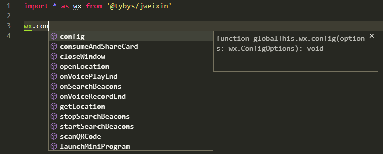
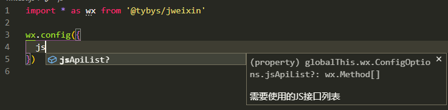
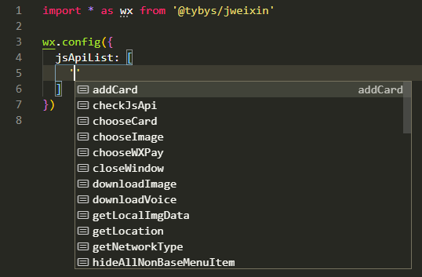

# jweixin

[微信 JSSDK](https://developers.weixin.qq.com/doc/offiaccount/OA_Web_Apps/JS-SDK.html) UMD 版本，并且附带 TypeScript 声明文件，提供 API 智能补全及类型提示。

官方提供的版本不能在 Webpack 里使用，改成 UMD 可以方便模块化开发。

版本号说明：

主版本号和次版本号跟随官方，修订号长度为 5 位，第一位固定是 1， 第二第三位是官方修订号，第四第五位是这个包的修订号，例如：

如果官方 sdk 版本是 1.6.0，这个包对应的版本是 1.6.100xx

如果官方 sdk 版本是 1.6.12，这个包对应的版本是 1.6.112xx

## 截图





## 安装

### 用 NPM：

``` bash
$ npm install @tybys/jweixin
```

### 从仓库源码构建：

``` bash
$ git clone https://github.com/toyobayashi/jweixin.git
$ cd jweixin
$ npm install
$ npm run build
```

输出在 `dist` 目录。

如果构建失败，请到文档中找他的地址下载一份 jweixin-x.x.x.js 手动放到 `src/jweixin.min.js` 后重新执行 `npm run build`。

## 用法

### 在全局从 CDN 引入

``` html
<script src="https://cdn.jsdelivr.net/npm/@tybys/jweixin/dist/jweixin.min.js"></script>
<!-- 也可以直接引用官方的 -->
<!-- <script src="http://res.wx.qq.com/open/js/jweixin-1.6.0.js"></script> -->
<script src="your-script.js"></script>
```

``` js
// your-script.js

// 三斜线指令引用声明文件，可在 VSCode 中看到智能提示
/// <reference path="node_modules/@tybys/jweixin/typings/jweixin.d.ts" />

console.log(wx);
console.log(jWeixin);
```

在纯 JS 项目中要获取 TS 类型智能提示，除了可以使用三斜线指令，也可以配置 `jsconfig.json`，类似 `tsconfig.json`，在 `include` 或 `files` 数组中加入声明文件，VS Code 能认识 `jsconfig.json`：

``` jsonc
{
  "compilerOptions": {
    // ...
  },
  "include": [
    "path/to/your-script.js",
    "node_modules/@tybys/jweixin/typings/jweixin.d.ts",
    // ...
  ]
}
```

### Webpack

CommonJS:

``` js
const wx = require('@tybys/jweixin')
```

ES Module:

``` js
// 下面两种都可以
import * as wx from '@tybys/jweixin'
import wx from '@tybys/jweixin'
```

### TypeScript

全局引入 SDK，只需要配置 `tsconfig.json`：

``` jsonc
{
  "compilerOptions": {
    // ...
  },
  "include": [
    "node_modules/@tybys/jweixin/typings/jweixin.d.ts",
    // ...
  ]
}
```

CommonJS:

``` jsonc
{
  "compilerOptions": {
    // ...
    "moduleResolution": "node",
    "module": "CommonJS",
    // "esModuleInterop": true
  }
}
```

``` ts
// 当 module 为 CommonJS 时
import wx = require('@tybys/jweixin') // ok
import * as wx from '@tybys/jweixin' // ok
import wx from '@tybys/jweixin' // compilerOptions.esModuleInterop = true
```

ES Module:

``` jsonc
{
  "compilerOptions": {
    // ...
    "moduleResolution": "node",
    "module": "ESNext",
    // "allowSyntheticDefaultImports": true
  }
}
```

``` ts
// 当 module 为 ES 模块时，不能使用 import x = require()
import * as wx from '@tybys/jweixin' // ok
import wx from '@tybys/jweixin' // compilerOptions.allowSyntheticDefaultImports = true
```
